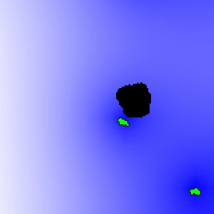

# evolutionary-potts
Modelling evolution and foraging behaviour using a Cellular Potts Model for the course Natural Computing.
Our algorithm uses evolution to optimize the foraging ability of cells.



## Requirements

Executing the algorithm requires nodejs, npm, python3 and several Python packages. The full list of Python packages is listed in requirements.txt. To set up the environment on Ubuntu, perform the following:

```
apt update
apt install nodejs npm python3 python3-pip
npm install
pip install -r requirements.txt
```

Note that this will install the Python packages for the entire system; if that is undesired you should install the requirements in a virtual environment. For convenience you can also execute ./setup.sh, which will perform the required actions for you and also **upgrade your system packages**.
## Running the algorithm

Evolving a group of cells using the parameters from our report can be accomplished by executing `python3 evolution/run.py`. You will be prompted to select the model that should be evolved (no chemokines, medium chemokines, high chemokines) and provide a seed. After this the evolution will run for 30 generations. The individuals of each generation are saved as json files in params/gen*. If you wish to store the printed output of the algorithm to a file, you can use standard Linux redirection: `python3 evolution/run.py > out.txt`. To exactly reproduce our results (requires 720 core-hours on a fast CPU!) run each model with the seed as specified below:

## Used seeds
Our report used the following seeds for each simulation type:
- high: 10, 100, 200
- medium: 300, 400, 500
- none: 600, 700, 800

## Simulating a single cell

You can run an Artistoo simulation for certain cell parameters with the command `node MODELPATH PARAMPATH [true]`. MODELPATH should be the (relative) path to the JavaScript file corresponding to the model that should be run, PARAMPATH should be the (relative) path to the parameter .json file generated by the Python script. If you wish to save images of the run, you can add the optional parameter `true`. Note that this will fail if the directory `output/img/ForagingModel/` does not exist. The console output will contain the position of the cell per time step and the final row will contain the values needed to calculate fitness. You can use Linux redirection to save this output to a file.

An example command to run a model without saving the output: `node src/runForagingModel.js params/gen1/0.json`. To run the same model, saving images of the run and recording the output to a text file: `node src/runForagingModel.js params/gen1/0.json true > sim.txt`.

An important point is that the params json file also contains the seed value used to simulate it in that generation, so simulation of a cell is reproducible given just the json file. The simulation of the cell will happen exactly like it did during that generation of the evolution.

## Creating a movie
You can create a movie of a cell simulation by first running the script using the above command to save the images and then executing `./makemovie.sh`. This requires that your system has imagemagick and ffmpeg installed. This script converts the output images with transparent backgrounds to have white backgrounds, which is necessary for proper video rendering.

## Changing evolution parameters
Some of the parameters of our algorithm are hardcoded. A list of these parameters and where they can be changed is given below:

- General CPM settings (torus, chemokine diffusion) - run/*.js, in config.conf
- CPM cell properties - evolution/evolution.py, j at top of create_param_files
- Livelihood/food settings - run/*.js, initialize function
- Misc simulation parameters - run/*.js, in config
- Number of evolution generations - evolution/run.py, second argument of evolution.evolve
- Size of each generation, mutation scale factor, number of elite cells to keep - global variables at top of evolution/evolution.py
- Variables that should be evolved - evolution/evolution.py, functions init_individual, mutate_)cell

## Example runs and outputs

The output of our experiments as contained in the report are located in folder `results/`. The JSON files in these folders can be run as described above, using the appropriate model file. Videos of example runs are located in `analyses/high/`, `analyses/medium` and `analyses/none`. A sample output trace is given in the file `eating.csv`.